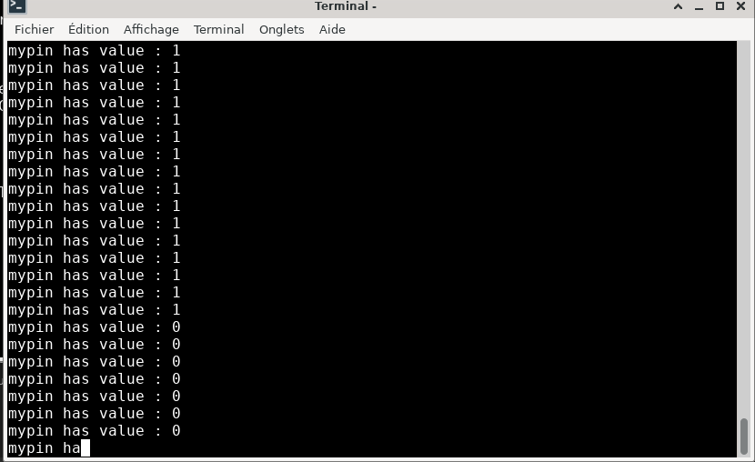
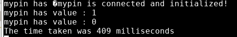
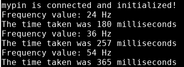
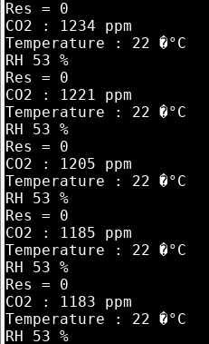
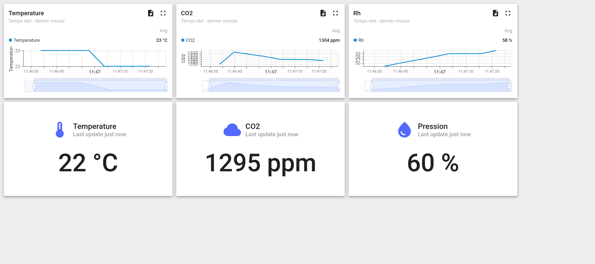

# EN326 : Capteurs pour l'embarqué

L'objectif est de s'initier au développement embarqué sous Mbed OS en communicant avec un capteur de CO2 sur une carte 6tron ZEST_CORE_FMLR-72 développée par le CATIE.

## Contributeurs

DELEGLISE Leonie
TABARDEL Bastien

## Guide d'installation et d'utilisation

Il faut tout d'abord cloner le dépôt.

```
git@github.com:Luzgog/Cour_Capteur.git
```

Il est nécessaire d'installer Mbed et ses outils. Pour cela il faudra suivre le guide suivant : https://6tron.io/ressources_logicielles/mbed/setup-tools

Il faut rajouter la variable d'environnement MBDE_GCC_ARM_PATH dans le PATH. Cela indique à Mbed où se retrouve les outils de compilations.  
Sur les PC de l'école il se trouve dans /opt/gcc-arm-none-eabi/gcc-arm-none-eabi-10.3-2021-07/bin/. Il faudra donc rajouter dans le fichier .bashrc :

```
export MBED_GCC_ARM_PATH="/opt/gcc-arm-none-eabi/gcc-arm-none-eabi-10.3-2021-07/bin/"
export PATH=$MBED_GCC_ARM_PATH:$PATH
```

Il est nécessaire de créer un environnement python virtuel, il est recommandé de le faire à l'extérieur du dossier cloné :

```
python -m venv <venv_name>
```

Il faudra ensuite l'activer :

```
source <venv_name>/bin/activate
```

Il faudra ensuite définir la cible et la toolchain :
```
mbed new .
mbed target ZEST_CORE_FMLR-72
mbed toolchain GCC_ARM
```

A la suite du clonage il faudra télécharger les dépendance du projet avec la commande
```
mbed deploy
```


Le projet pourra être compilé avec la commande `mbed compile` et la carte pourra être programmée avec la commande `sixtron_flash`.

La cible communiquera sur le port USB avec un baudrate de 9600. On pourra lire les communications avec des outils comme minicom ou mbed sterm de la manière suivante (remplacer x par le port correspondant) :
```
minicom -b 9600 -D /dev/ttyUSBx
mbed sterm --port /dev/ttyUSBx --baud 9600
```

## Travaux Pratiques

On peut retrouver le code correspondant aux exercices dans l'historique du depôt.
Il peut se trouver dans nos commit un fichier manquant pour finir la compilation de notre code.
Deplacer le fichier **custom_targets.json** dans le dossier de travail :

```
cp mbed_zest-core-fmlr-72/custom_targets.json .
```
Si ce fichier n'est pas présent, il faudra le telecharger sur notre dépot et le rajouter dans le dossier de travail :
https://github.com/Luzgog/Cour_Capteur

### Partie 2 : 

Pour l'exercice sur le **polling** :
```
git checkout 5dbc72d1416707ebee969c89a6031e48a81fb341
mbed compile
sixtron_flash
```


Lors d'un appui sur SW1, nous allons voir dans minicom l'état de la LED.

Pour l'exercice sur **l'interruption**:

```
git checkout a057de5a52a7f637613bb55a0ad90a4d7b5e59f5
mbed compile
sixtron_flash
```

Nous obtiendrons le même résultat qu'auparavant, avec en plus la durée de pression sur SW1.




Pour l'exercice sur **le ticker** :

```
git checkout 0dbb1001cb92067828e2e7bf30662f26c3d56703
mbed compile
sixtron_flash
```



La carte va faire clignotter la led et incrémenter la fréquence de clignotement à chaque appuie du boutton.

### Partie 3 : 

Les travaux pratique sur **l'I2C**:

Le capteur à l'adresse I2C 0x62.

La mesure peut être lu dans le registre d'adresse 0xec05.

La donnée lu fait 9 octets dont 3 qui sont uniquement des CRC.

Nous avons réalisé une classe regroupant les interactions avec le capteur. On peut retrouver l'utilisation de cette classe sur le commit suivant. Attention cependant il n'est plus nécessaire de faire la copy du custom-target.json.

```
git checkout b39f0adb7c8915757cbc7bb542f9f2a394be5542
mbed compile
sixtron_flash

```




### Partie 4 : 

Pour l'exercice sur les **threads**:

```
git checkout c8827d9a2ee033a621bd7586c0160cd3a550a4d8
mbed compile
sixtron_flash
```
On remarquera dans cet exercice que si nous n'ajoutons pas de **`sleep`** dans les threads, cela peut entraîner une surcharge du processeur. De plus, les **`printf`** sont très coûteux en termes de temps d'exécution, ce qui peut impacter les performances globales du programme.

Nous avons donc vu qu'il etait possible d'utiliser des mutex pour que le programme reste stable et prédictible, même dans un environnement concurrentiel.

Pour l'exercice sur les **mutex**:

```
git checkout 497c286cc14bedb9627d7c95b08282342cca461c
mbed compile
sixtron_flash
```

### Projet final 

Le projet lora se trouve sur le dernier commit 

```
git checkout main
mbed compile
sixtron_flash
```
Vous trouverez ci-dessous le rendu de notre dashboard : 




## Organisation du code

Le code est séparé en plusieurs fichiers :
- main.cpp qui gère l'envoie et la récpetion de donnée lorawan
- lora_radio_helper qui contient des informations de configuration du lorawan
- Driver_CO2.cpp/hpp qui contient une classe gérant la communication avec le capteur

Cette classe dispose de méthodes privées qui sont utilisées pour envoyer des commandes aux capteurs.  
Des méthodes publiques permettent ensuite d'intéragir avec le capteur en se servant des méthodes privées avec les adresses et les délais de communication déjà configuré. Cela permet à l'utilisateur de ne pas avoir à saisir l'adresse du registre ainsi que les délais auquel il doit accéder pour chaque action.

L'utilisateur n'a alors accès qu'a  4 méthodes :
    - start_periodic_measurement pour démarrer les mesures périodiques
    - read_co2_measurement pour lire les données mesurés par le capteur
    - stop_periodic_measurement pour arrêter les mesures périodiques du capteur
    - factory_reset pour envoyer une commande de reset au capteur
